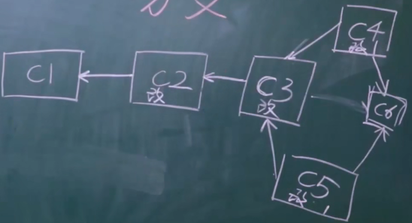

#### git 安装 使用git 生成本地版本

##### git安装

官网安装 安装成功之后通过 git --version查看
个人信息配置:用户名、邮箱 

   ```
   git config --global user.email "you@email.com"
   git config --global user.name  "Youer name"
   ```

##### git 生成版本

1. 进入要管理的目录

2. git init 初始化仓库

3. git status 检测当前文件夹下边的文件状态

4. 三种状态的变化  工作区包括已修改的文件和已管理未修改的文件

   - （工作区）红色 新增的文件或者修改过为未被管理的文件   -》 git add  .  (.点)代表当前文件夹未被管理的所有文件 git add 命令 把工作区文件提交到暂存区
   - （暂存区）绿色： 已经被管理但未生成新版本的文件 -》 git commit -m "描述信息"
   - （版本库）生成版本

- git status

  - ```
    On branch master
    nothing to commit, working tree clean
    意味着当前文件夹里的所有文件都被git管理起来，生成了一个版本
    ```

  - ```
      modified:   git_01.md
    说明在上一个版本的基础上修改了 git_01.md文件
    ```

git add . 再一次 管理修改的文件

git status 再一次检测当前文件夹下边的状态

git commit -m “v2” 生成第二个版本

git log 查看版本记录

##### git 版本回滚

```
git log 查看版本记录
git reset --hard 版本号
# 从 v3 回滚到 v2
git reset --hard b21743608ace44695bc7fcce8b72a47d9fbae706
# 再从v2 回滚到v3
git reflog  可以查看 回滚之前的版本号g
git reset --hard 18306a1 回滚到v3版本  版本库到工作区
```

从版本库回滚到工作区

```
git reset --hard 版本号
```

从版本库回滚到暂存区

```
git reset --soft 版本号
```

从暂存区回滚到工作区

```
git reset HEAD
git reset HEAD git_01.md
```

从已修改且被管理的文件回滚到未管理状态

```
git checkout 
git checkout -- git_01.md
```

从版本库回滚到工作区已被管理状态

```
git reset --mix 版本号
```

#### 分支



##### 线上代码出现bug紧急修复的思路

```
git branch bug 创建bug分支
git checkout bug 切换分支
```


默认主干 叫master  

##### 命令

打印当前所属分支

```
git branch 打印当前所属的分支
```

创建新的分支

```
git branch dev 创建名为dev的新分支
```

切换分支

```
git checkout dev 切换到dev分支 在这个环境中写代码是不影响master分支的
```

合并分支

```
git branch 查看当前分支
git checkout master 先切换回当前分支
git merge bug 将bug分支合并到master分支
```

删除分支

```
git branch -d bug 删除bug分支
```

