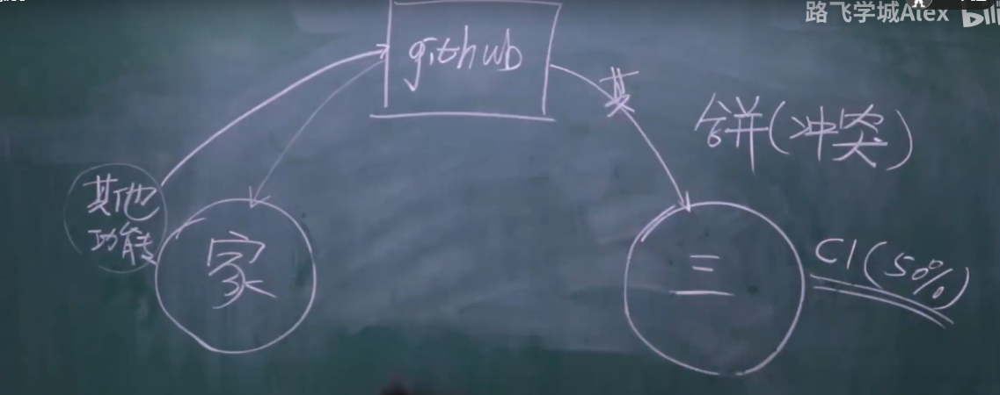

#### github/gitlab

##### 注册账号

#####  创建仓库

##### 在家里上传代码

1. 本地没有代码

   ```
   首先创建 README.md
   git init 
   git add README.md
   git commit -m "first commit"
   git remote add origin https://github.com/heyuyang/git_note.git 给远端仓库起别名
   git push -u origin 分支  向远程推送代码
   ```

2. 本地有代码

   ```
   git remote add origin https://github.com/heyuyang/git_not.git
   git push -u origin master 推送到远端master分支
   ```

##### 公司新电脑第一次获取代码

```
git clone 远程仓库地址 （内部已经实现了git remote add origin 远程仓库 这一操作）
git log
git status
git branch  虽然只显示一个master分支 但其实master 和dev分支都copy了 
git checkout dev 可以直接切换到dev分支
```

##### 在公司进行开发

1. git branch 切换到dev分支

2. git log 查看log信息 确定dev分支是否和master分支代码是否在同一状态

3. git merge master (在dev分支合并)  将master合并到dev【仅执行一次】

4. 写代码

5. 提交代码

   git add .

   git commit -m "提交今天写的代码a1功能"

   git push -u origin master  默认分支

   ​             git push origin dev 相当于手动指定，把当前代码提交到dev分支

##### 回到家中继续写代码

1. git branch 查看分支

2. git checkout dev  切换到dev分支

3. git pull origin dev  将远程最新的代码拉到本地，更新本地代码

4. 写代码

5. 提交代码

   git add .

   git commit -m "另一台电脑的代码a2功能"

   git push -u origin dev

   ​                git push origin dev

##### 开发完毕，要上线

```
1.将dev分支合并到master，进行上线
	git checkout master
	git merge dev  将dev分支合并到master
	git push origin master
2.把dev分支也推送到远程
	git checkout dev
	git merge master
	git push origin dev
```

##### 本地生成版本，没有推送到github




手动解决产生冲突的文件

##### 补充

```
git pull origin dev
等价于
git fetch origin dev  把代码从远程仓库拉到版本库
git merge origin/dev  合并从远程仓库拉来的分支 通常要加前缀origin/
```

