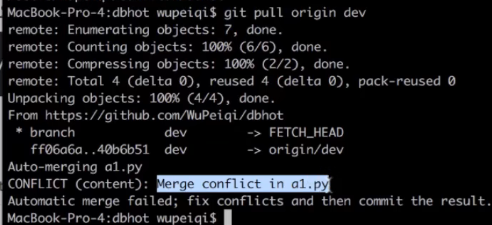

## git将本地已有的一个项目上传到新建的git仓库

### 1. clone+copy

直接将远程仓库拉到本地，然后再把自己本地的项目拷贝到仓库中。然后push到远程仓库上。**适用于本地项目不是一个git仓库的情况**

1. clone

   ```bash
   git clone git@github.com:Hewuxin/TestProject.git
   ```

2. 将本地项目拷贝到TestProject目录下
3. 添加到缓存区，提交

    ```bash
    git add .
    git commit -m ""
    ```

4. push到远程仓库上面

   ```bash
   git push -u orgin master
   ```

### 2.强行合并两个仓库

现将本地的项目初始化为一个git仓库，然后再**强行合并本地仓库和远程仓库**，由于这两个仓库是完全不同的两个仓库，所以直接pull会报错，需要在**pull的时候加上-allow-unreleated-histories**才可以pull成功。

1.  新建git仓库，将本地项目设置为一个git仓库。add commit

   ```bash
   git init
   git add .
   git commit -m "push current files"
   ```

2. 将本地仓库与远程仓库关联起来

   ```bash
   git remote add origin git@github.com:Hewuxin/TestProject.git
   ```

3. pull 远程仓库的内容，更新本地仓库，使用 --allow-unrelated-histories忽略本地仓库和远程仓库的无关性，强行合并

   ```bash
   git pull orgin main --allow-unrelated-histories
   ```

4. 把本地仓库的内容push到远程仓库

   ```bash
   git push -u origin master
   ```

##### 注册账号

#####  创建仓库

##### 在家里上传代码

1. 本地没有代码

```
首先创建 README.md
git init 
git add README.md
git commit -m "first commit"
git remote add origin https://github.com/heyuyang/git_note.git 给远端仓库起别名
git push -u origin 分支  向远程推送代码
```

2. 本地有代码

```
git remote add origin https://github.com/heyuyang/git_not.git
git push -u origin master 推送到远端master分支
```

##### 公司新电脑第一次获取代码

```
git clone 远程仓库地址 （内部已经实现了git remote add origin 远程仓库 这一操作）
git log
git status
git branch  虽然只显示一个master分支 但其实master 和dev分支都copy了 
git checkout dev 可以直接切换到dev分支
```

##### 在公司进行开发

1. git branch 切换到dev分支

2. git log 查看log信息 确定dev分支是否和master分支代码是否在同一状态

3. git merge master (在dev分支合并)  将master合并到dev【仅执行一次】

4. 写代码

5. 提交代码

   git add .

   git commit -m "提交今天写的代码a1功能"

   git push -u origin master  默认分支

   ​             git push origin dev 相当于手动指定，把当前代码提交到dev分支

##### 回到家中继续写代码

1. git branch 查看分支

2. git checkout dev  切换到dev分支

3. git pull origin dev  将远程最新的代码拉到本地，更新本地代码

4. 写代码

5. 提交代码

   git add .

   git commit -m "另一台电脑的代码a2功能"

   git push -u origin dev

   ​                git push origin dev

##### 开发完毕，要上线

```
1.将dev分支合并到master，进行上线
	git checkout master
	git merge dev  将dev分支合并到master
	git push origin master
2.把dev分支也推送到远程
	git checkout dev
	git merge master
	git push origin dev
```

##### 本地生成版本，没有推送到github




手动解决产生冲突的文件

##### 补充

```
git pull origin dev
等价于
git fetch origin dev  把代码从远程仓库拉到版本库
git merge origin/dev  合并从远程仓库拉来的分支 通常要加前缀origin/
```

## 问题解决

### 1. 分支推送错误

#### 问题描述：

​	$\color{red}本应该推送本地的dev分支到远程，错把main分支推送$

#### 方法一

撤销最后一次的 `git push`，不用指定特定的提交哈希值。这将覆盖远程分支为当前本地分支的状态。
`git push --force` 

#### 方法二 撤销已经完成的 `git push` 操作

1. **备份更改**

   在撤销 `git push` 之前，要撤销的更改已经备份。通过创建一个新的分支或者备份当前工作目录的副本来实现这一点。

  2. **查找要撤销的提交**

     执行 `git log` 命令，找到要撤销的提交的哈希值。

3. **强制推送到远程仓库**

   执行 `git push --force <remote_name> <commit_id>:<branch_name>` 命令,其中 `<remote_name>` 是远程仓库名称，`<commit_id>` 是要撤销的提交的哈希值，`<branch_name>` 是分支名称。

```
找到想要撤销的提交的哈希值
git log  
执行强制推送命令。要撤销到一个名为 main 的分支，远程仓库名称为 origin，提交的哈希值为 abc123
git push --force origin abc123:main 
```

