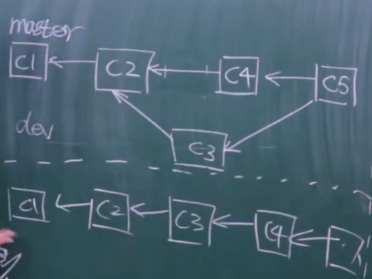
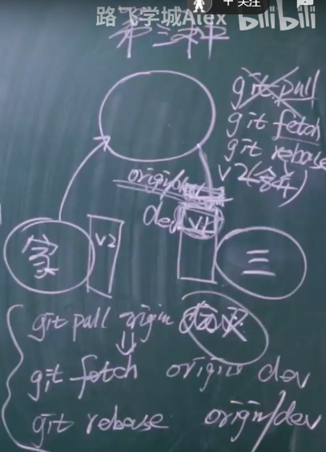

## rebase(变基)  面试经常考

本质帮助代码git提交记录变的简洁

##### 第一种 把多个提交记录整合成一个记录

```
git rebase -i HEAD~3  将最新的3个版本记录进行合并
修改 合并之后的注释信息
```


##### 注意：合并记录时不要合并已经push到远程仓库的版本库记录

##### 第二种 把分叉的分支版本合并到主线分支



```
git log --graph 以图形方式显示log
git log --graph --pretty=format:"%h %s" 格式化输出 只输出哈希值和注释
git checkout dev
git rebase master
git checkout master
git merge dev
git log --graph --pretty=format:"%h %s"
```

##### 第三种



##### 注意事项

git rebase 可能会产生冲突，解决冲突 先执行提示的命令 之后执行 git rebase --continue

```
1.先解决冲突
2.git add .
3.git rebase --continue
```

