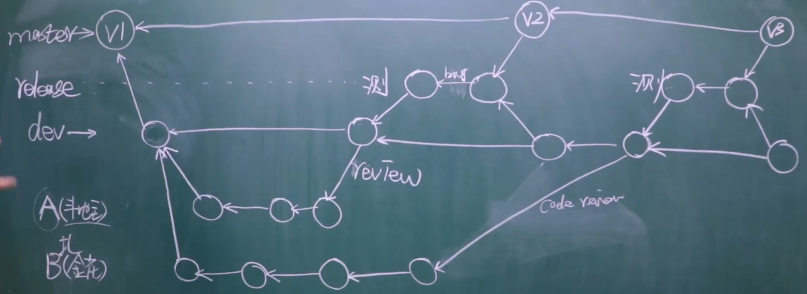
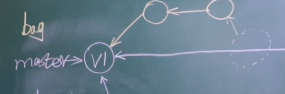
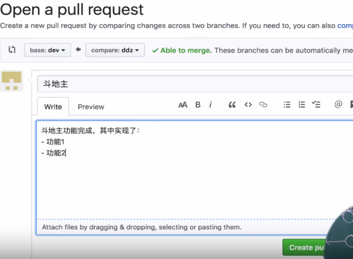
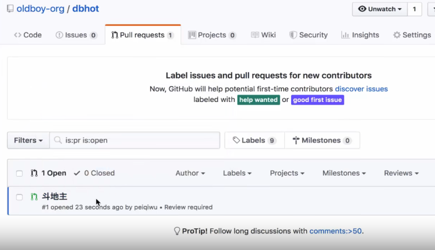
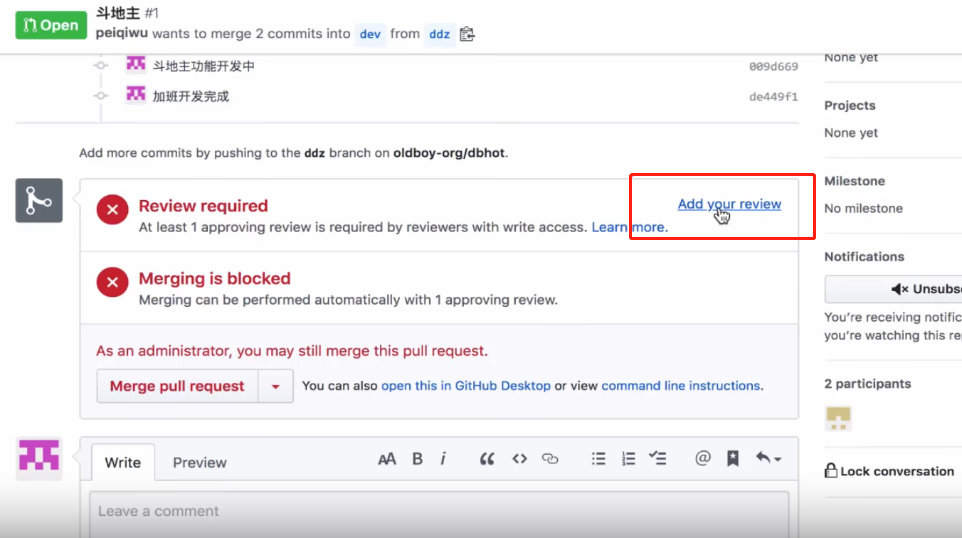
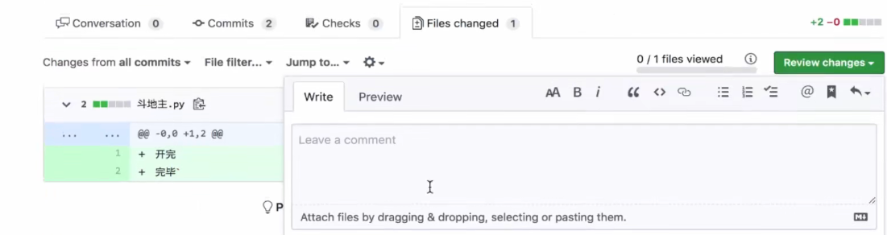
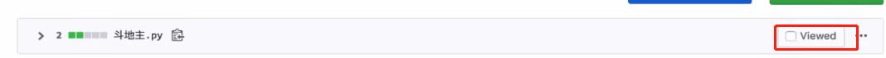
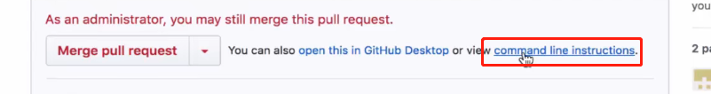
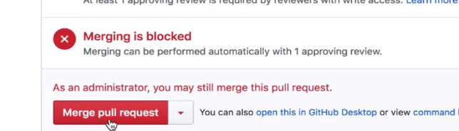
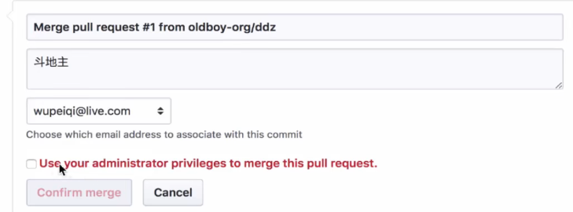

#### 多人协同开发

##### gitflow工作流

有些公司可能不做release 和code review



可能出现的问题：

- 线上代码出bug
- 
- 创建一个bug分支解决bug之后再合并到master分支

#####  面试题：

如何做多人协同开发？ 每人有一个自己的分支，在自己的分支上完成自己该做的功能之后进行合并

##### 创建初始项目和版本

1. 创建初始项目

2. 创建github远程仓库
   1. 点击settings中的Collaborators多人协同需要邀请别人
   2. 公司创建项目
      1. 先创建组织，在组织里创建项目
      2. new organization
      3. 在其中创建项目
   3. 把初始项目推送到远程仓库
   
3. 创建dev分支，并向远程仓库推送dev

   ```
   git checkout -b dev 创建dev分支并切换到dev分支
   git branch
   git push origin dev
   ```

4. 公司一般使用gitlab，先注册账号 之后邀请成员

5. 成员权限

   1. 对于组织，点击组织的settings中的Member privileges

      ```
      默认权限 只读
      ```

   2. 对于项目也可以设置权限，项目的settings中的Collaborators&teams邀请成员

6. 成员操作

   ```
   git clone 项目地址
   git checkout dev
   git checkout -b function 默认情况下在当前分支去创建
   写代码
   提交到远程仓库
   回家之后继续开发
   开发完毕，提交到远程仓库
   ```

7. code review

##### 测试上线

```
git checkout -b release 创建release分支并切换到release分支
git push origin release 
下一步 测试人员可以把代码拉走之后进行测试
测试完成之后可以选择pull request也可以选择通过master分支合并release分支
git branch
git checkout dev
git merge release 将release分支合并到dev
git branch -d release 删除release分支
git branch 
git checkout master 此时master只有v1
git pull origin master 
git tag -a v2 —m "第二版 增加斗地主功能"
git push origin --tags
```

##### 版本管理

```
git tag -a v1 -m "第一版"  给版本打一个标签 本地
git push origin --tags 向远程仓库推送标签
```

##### code review  面试可能问到

1. 谁来做code review  小组长

2. github上的pull/merge  request
   1. 配置

      1. 点击项目中的settings中的branches，在点击 add rule ，之后create

         ```
         Branch name pattern
         分支名
         选中 Require pull request reviews before merging 指当想要把代码合并到dev分支时需要做一次code review,review完成之后才能进行合并
         ```

      2. master也应该配置

3.成员在项目中点击new pull request提交pull request

1. 选中要把哪个分支合并到哪个分支

   

2. 对于leader而言，

   1. 在pull request中可以看到别人请求进行一次pull request，点击该pull request

      

      

      

      

      

   ```
   也可以使用命令去做
   Step1：From your project repository,bring in the changes and test.
   git fetch origin  # 把斗地主功能拉到leader本地做代码review，review完成之后再提交到dev
   git checktout -b ddz origin/ddz
   git merge dev
   
   
   Step2: Merge the changes and update on Github.
   git checkout dev
   git merge --no-ff ddz
   git push origin dev
   ```

   2. review之后 

      

      

   3. 功能开发完成之后，并且已经review、merge之后就可以选择delete branch

##### 注意事项：

在code review 或 merge中也可能产生冲突，之后先解决冲突然后再合并